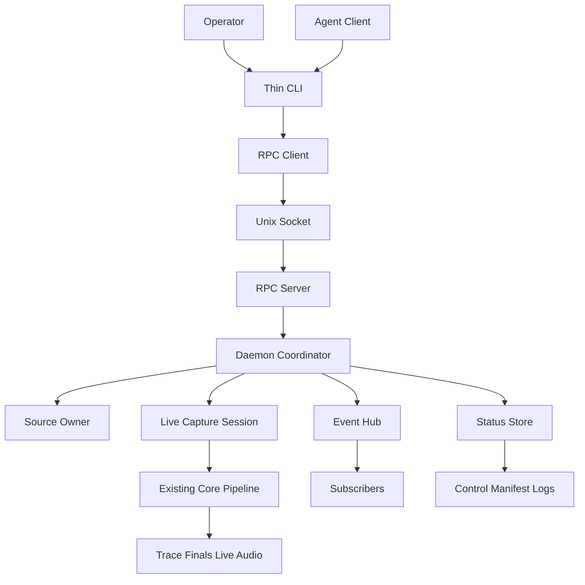
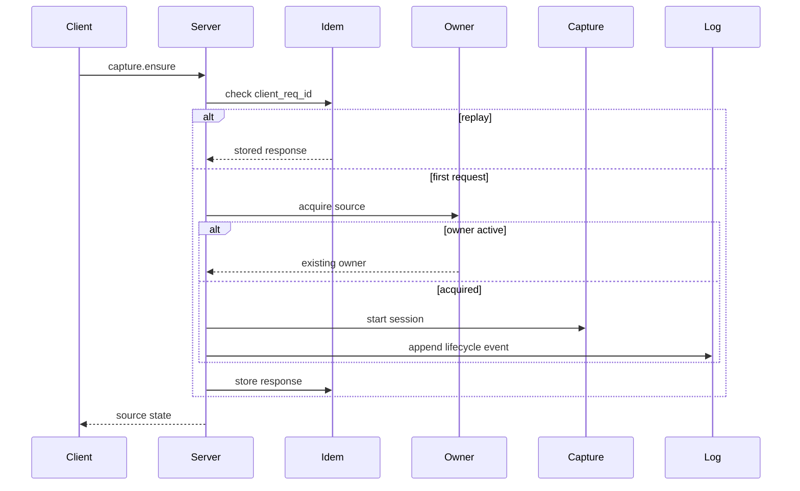
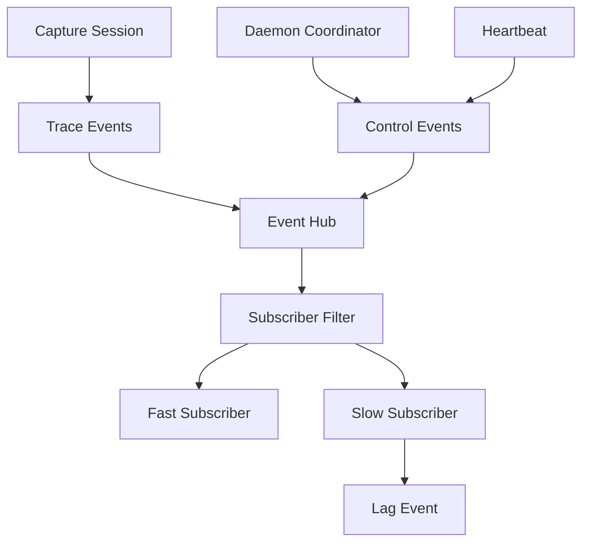
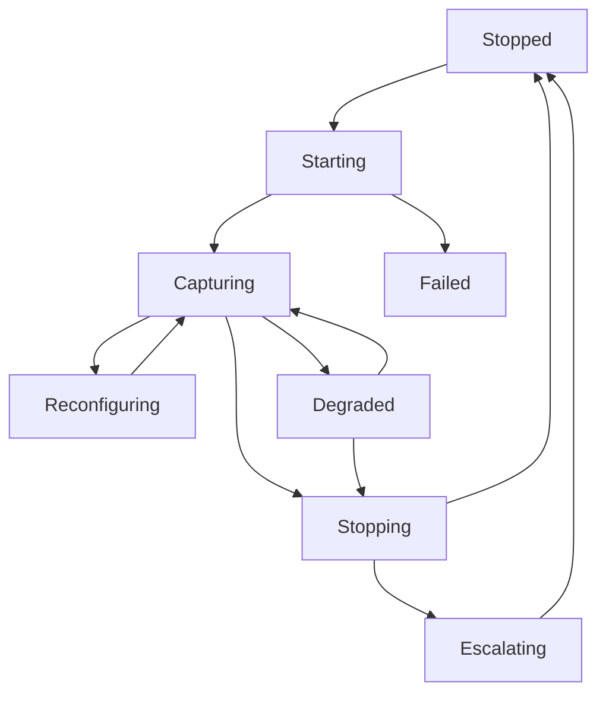
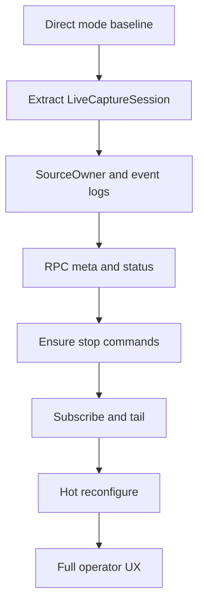

# Design Document

## Overview

This feature adds a local control plane around Chronicle live capture so agents
and operator tools can safely observe and control 24/7 `sysaudio` and `mic`
sessions. It preserves the current direct capture path while introducing one
source owner per physical source, machine-readable status, retry-safe mutations,
filtered subscriptions, markers, recent clips, hot reconfiguration gates, and
crash recovery state.

The design is an extension of the existing SwiftPM executable. `Subcommands/`
remain thin CLI veneers. New reusable behavior lands under `Core/Daemon/` and a
small `Core/Capture/` extraction that lets daemon mode wrap the current
`Mic.swift` and `SysAudio.swift` pipelines without replacing CoreAudio taps,
SpeechAnalyzer, sidecar sinks, or Sortformer diarization.

### Goals

- Prevent duplicate physical capture owners for `sysaudio` and `mic`.
- Give agents a local, self-describing, retry-safe control surface.
- Preserve current low-latency rough transcript behavior and direct-mode
  rollback.
- Make daemon events, health, and recovery state durable and machine-readable.

### Non-Goals

- Replace CoreAudio process taps or current live transcription internals.
- Merge microphone and system audio into one raw transcriber stream.
- Add network control, token auth, cloud transcription, retention policy,
  speaker identity memory, or launch-at-login packaging.
- Remove direct `mic` / `sysaudio` subcommands.

## Boundary Commitments

### This Spec Owns

- Source-owner lifecycle for `sysaudio` and `mic`.
- Local Unix-socket JSON-RPC protocol, schema discovery, typed errors, and thin
  CLI clients.
- Daemon-owned status, heartbeats, leases, idempotency records, and control
  events.
- Filtered live event subscriptions with explicit lag behavior.
- Marker creation and recent clip request coordination.
- Hot reconfiguration policy and daemon-visible outcomes.
- Crash-recovery state for daemon epochs and daemon-owned event logs.

### Out of Boundary

- CoreAudio tap replacement or changes to system-audio capture backend.
- SpeechAnalyzer, Sortformer, audio storage, or trace semantics beyond additive
  daemon wrapping.
- Production cloud APIs.
- Network-exposed remote control.
- Long-term storage pruning/retention.
- Speaker identity memory and downstream summarization/tagging behavior.
- launchd/login item creation.

### Allowed Dependencies

- Existing `Mic` and `SysAudio` direct pipeline behavior.
- `Core/Audio`, `Core/Speech`, `Core/Diarize`, `Core/Sinks`, and `Core/Runtime`
  primitives.
- `AtomicFile.appendLine` for append-only JSONL durability.
- Existing `JSONLTraceSink` and readers for transcript trace compatibility.
- Swift Foundation/Darwin primitives for files, sockets, signals, and process
  state.
- Installed signed `/Applications/chronicle.app` for live TCC workflows.

### Revalidation Triggers

- Any JSON-RPC method, error, or event schema compatibility change.
- Any change to source ownership semantics or socket path discovery.
- Any change that makes direct `mic` / `sysaudio` no longer a rollback path.
- Any change to base transcript startup ordering or progressive-layer prewarm
  behavior.
- Any change to JSONL recovery guarantees or sidecar path layout.

## Architecture

### Existing Architecture Analysis

Chronicle is already organized around thin `Subcommands/` and reusable `Core/`
domains. `SysAudio.swift` and `Mic.swift` currently compose source setup,
sidecar setup, optional diarization, result sinks, diagnostics, and shutdown in
the subcommand file. `JSONLTraceSink` already writes source-aware transcript
JSONL using `AtomicFile.appendJSONLine`; `AtomicFile.appendLine` already protects
append writes with `O_APPEND` and `flock` on Darwin.

The daemon control plane should extract orchestration seams from the direct
subcommands but leave audio, speech, diarization, sidecar, and locale components
in their current domains.

### Architecture Pattern & Boundary Map

**Selected pattern:** source-owner daemon with thin local RPC clients.



**Dependency direction:**

`DaemonTypes → RuntimePaths → RPCProtocol → CaptureSession → DaemonCoordinator → Subcommands`

Lower layers must not import CLI subcommands. `Core/Capture` may depend on
existing `Core/Audio`, `Core/Speech`, `Core/Sinks`, and `Core/Diarize`.
`Core/Daemon` may depend on `Core/Capture` and `Core/Runtime`, but not the other
way around.

### Technology Stack

| Layer | Choice / Version | Role in Feature | Notes |
| --- | --- | --- | --- |
| CLI | Swift ArgumentParser existing version | Thin command surface | New subcommands only serialize requests and render responses. |
| Services | Swift actors/classes in `Core/Daemon` | Source ownership, RPC, state, subscriptions | No new package dependency. |
| Data / Storage | JSONL files via `AtomicFile` | Manifest, control, heartbeat, and recovery events | Reuse append durability; keep trace compatibility additive. |
| Messaging / Events | JSON-RPC 2.0 over Unix socket plus JSONL event streams | Local control and subscribe | Build in tree with Foundation/Darwin. |
| Runtime | Signed `.app`, macOS 26, Darwin sockets/flock | Live capture and local permissions | No network listener. |

## File Structure Plan

### Directory Structure

```text
Sources/Chronicle/
├── Subcommands/
│   ├── Daemon.swift          # daemon run entrypoint
│   ├── Start.swift           # thin capture.ensure client
│   ├── Stop.swift            # thin capture.stop client
│   ├── Status.swift          # thin status.get client
│   ├── Tail.swift            # thin events.subscribe client
│   ├── Mark.swift            # thin mark.create client
│   ├── Clip.swift            # thin clip.create client
│   └── Config.swift          # thin capture.reconfigure client
└── Core/
    ├── Capture/
    │   ├── LiveCaptureConfiguration.swift  # normalized capture settings
    │   ├── LiveCaptureSession.swift        # reusable direct/daemon capture runner
    │   └── LiveCaptureStatus.swift         # capture counters and health projection
    └── Daemon/
        ├── DaemonTypes.swift               # source, lifecycle, epoch, request ids
        ├── SourceOwner.swift               # PID/flock owner gate
        ├── RuntimePaths.swift              # socket/lock/log path resolution
        ├── DaemonEvent.swift               # common control/manifest event envelope
        ├── DaemonEventLog.swift            # append/read/recovery for daemon JSONL
        ├── DaemonStatus.swift              # status snapshot model
        ├── Heartbeat.swift                 # heartbeat writer/freshness state
        ├── RPCProtocol.swift               # JSON-RPC envelopes and errors
        ├── OpenRPCSchema.swift             # meta.schema response
        ├── RPCServer.swift                 # Unix socket server and request routing
        ├── ChronicleRPCClient.swift        # local socket client
        ├── IdempotencyStore.swift          # client_req_id replay cache
        ├── LeaseStore.swift                # TTL leases and expiry events
        ├── EventFilter.swift               # subscribe filter model
        ├── EventHub.swift                  # bounded subscriber fan-out
        ├── ClipCoordinator.swift           # recent clip request coordination
        └── DaemonCoordinator.swift         # method handlers and capture lifecycle
Tests/ChronicleTests/
├── Capture/
│   └── LiveCaptureConfigurationTests.swift
└── Daemon/
    ├── SourceOwnerTests.swift
    ├── RuntimePathsTests.swift
    ├── DaemonEventLogTests.swift
    ├── RPCProtocolTests.swift
    ├── OpenRPCSchemaTests.swift
    ├── IdempotencyStoreTests.swift
    ├── LeaseStoreTests.swift
    ├── EventHubTests.swift
    ├── DaemonStatusTests.swift
    └── DaemonCoordinatorTests.swift
scripts/
└── smoke-daemon-kill9.sh
```

### Modified Files

- `Sources/Chronicle/Chronicle.swift` — register daemon/client subcommands.
- `Sources/Chronicle/Subcommands/Mic.swift` — delegate shared capture setup to
  `LiveCaptureSession` while preserving current direct CLI behavior.
- `Sources/Chronicle/Subcommands/SysAudio.swift` — same extraction for system
  audio; direct mode remains runnable.
- `Sources/Chronicle/Core/Sinks/JSONLTraceSink.swift` — add daemon mapping hooks
  only if needed; existing trace schema stays readable.
- `README.md` — document daemon UX and direct-mode rollback.
- `docs/STATUS.md` — record P12 implementation receipts after completion.

## System Flows

### Ensure Capture Flow



### Event Subscription Flow



### Lifecycle State



## Requirements Traceability

| Requirement | Summary | Components | Interfaces | Flows |
| --- | --- | --- | --- | --- |
| 1.1 | Reject duplicate source owners before capture starts | SourceOwner, DaemonCoordinator | capture.ensure, daemon run | Ensure Capture |
| 1.2 | Report existing owner without interrupting capture | SourceOwner, DaemonStatus | Structured error/status | Ensure Capture |
| 1.3 | Distinguish stale ownership after unclean exit | SourceOwner, DaemonEventLog | manifest recovery event | Lifecycle State |
| 1.4 | Maintain independent source state | DaemonTypes, RuntimePaths, SourceOwner | source enum/path contracts | Lifecycle State |
| 2.1 | Start returns existing running state | DaemonCoordinator, IdempotencyStore | capture.ensure | Ensure Capture |
| 2.2 | Repeated mutation returns same result | IdempotencyStore | client_req_id | Ensure Capture |
| 2.3 | Status succeeds when stopped | DaemonStatus | status.get | Lifecycle State |
| 2.4 | Stop is idempotent when stopped | DaemonCoordinator | capture.stop | Lifecycle State |
| 2.5 | Status includes source/session/health counters | DaemonStatus, LiveCaptureStatus | status.get response | Lifecycle State |
| 3.1 | Schema discovery returns methods and contracts | OpenRPCSchema | meta.schema | Ensure Capture |
| 3.2 | Compatibility version changes on breaking method change | OpenRPCSchema | protocolVersion | n/a |
| 3.3 | Unsupported/malformed requests return structured errors | RPCProtocol, RPCServer | JSON-RPC error | n/a |
| 3.4 | Errors avoid stack traces | RPCProtocol | error envelope | n/a |
| 4.1 | Durable events include version/source/epoch/seq/times/type | DaemonEvent, DaemonEventLog | JSONL event envelope | Event Subscription |
| 4.2 | Restart records new epoch and recovery event | DaemonCoordinator, DaemonEventLog | manifest/control events | Lifecycle State |
| 4.3 | Torn trailing record recovery | DaemonEventLog | JSONL reader | Lifecycle State |
| 4.4 | Existing sidecars remain evidence | LiveCaptureSession, JSONLTraceSink | trace/finals/live/audio paths | Event Subscription |
| 5.1 | Subscribe streams final events | EventHub, EventFilter | events.subscribe | Event Subscription |
| 5.2 | Filters restrict delivered events | EventFilter | subscribe filters | Event Subscription |
| 5.3 | Heartbeat/EOF provides liveness | Heartbeat, EventHub | heartbeat event | Event Subscription |
| 5.4 | Slow subscriber lag policy | EventHub | subscriber_lagged event | Event Subscription |
| 6.1 | Progressive layer toggles keep rough transcript active | LiveCaptureSession, DaemonCoordinator | capture.reconfigure | Lifecycle State |
| 6.2 | Unsafe active changes rejected with alternative | LiveCaptureConfiguration | reconfigure error | Lifecycle State |
| 6.3 | Reconfigure start/completion events recorded | DaemonEventLog | control events | Lifecycle State |
| 6.4 | Layer failure separated from source health | DaemonStatus, LiveCaptureStatus | status.get/control event | Lifecycle State |
| 7.1 | Active marker appends timestamped event | DaemonCoordinator, DaemonEventLog | mark.create | Event Subscription |
| 7.2 | Marker with no session reports no-active-session | DaemonCoordinator | mark.create error | n/a |
| 7.3 | Available clip window exports or reports path | ClipCoordinator | clip.create | n/a |
| 7.4 | Unavailable clip window reports available range | ClipCoordinator | clip.create error | n/a |
| 7.5 | Multi-step client state does not orphan | LeaseStore | lease events | n/a |
| 8.1 | Running owner publishes heartbeats | Heartbeat | heartbeat event | Event Subscription |
| 8.2 | Idle output reported separately from failure | DaemonStatus, LiveCaptureStatus | status.get | Lifecycle State |
| 8.3 | Heartbeat expiry reports stale/unavailable | Heartbeat, DaemonStatus | status.get | Lifecycle State |
| 8.4 | Runtime evidence is health authority | LiveCaptureStatus | status.get | Lifecycle State |
| 9.1 | Normal stop attempts graceful finalization | DaemonCoordinator, LiveCaptureSession | capture.stop | Lifecycle State |
| 9.2 | Bounded stop escalates and preserves evidence | DaemonCoordinator | stop result/control event | Lifecycle State |
| 9.3 | Abrupt kill leaves complete records parseable | DaemonEventLog, AtomicFile | JSONL recovery | Lifecycle State |
| 9.4 | Restart reports previous termination/recovery | DaemonEventLog, DaemonStatus | manifest/status | Lifecycle State |
| 10.1 | Control is local-only | RuntimePaths, RPCServer | Unix socket | n/a |
| 10.2 | Production behavior requires no cloud | DaemonCoordinator | all methods | n/a |
| 10.3 | Cloud voice fixture remains test-only | scripts/smoke-sysaudio-diarize.sh | test fixture boundary | n/a |
| 10.4 | Direct live commands remain rollback | Mic, SysAudio, README | direct CLI | n/a |

## Components and Interfaces

| Component | Domain/Layer | Intent | Req Coverage | Key Dependencies | Contracts |
| --- | --- | --- | --- | --- | --- |
| `LiveCaptureSession` | Capture | Reusable direct/daemon live pipeline runner | 4.4, 6.1, 6.4, 8.4, 9.1, 10.4 | Existing Core pipeline P0 | Service, State |
| `LiveCaptureConfiguration` | Capture | Normalize settings and hot-change policy | 6.1, 6.2 | Existing CLI flags P1 | State |
| `SourceOwner` | Daemon Runtime | Enforce one owner per source | 1.1, 1.2, 1.3, 1.4 | Darwin flock P0 | Service, State |
| `RuntimePaths` | Daemon Runtime | Resolve socket/lock/log paths | 1.4, 10.1 | FileManager P0 | Service |
| `DaemonEventLog` | Daemon Storage | Append/read/recover daemon JSONL | 4.1, 4.2, 4.3, 6.3, 9.3, 9.4 | AtomicFile P0 | Event, State |
| `RPCServer` | Daemon RPC | Serve local JSON-RPC requests | 3.3, 10.1 | RuntimePaths P0 | API |
| `ChronicleRPCClient` | Daemon RPC | Shared client for thin subcommands | 2.1, 2.3, 5.1 | RPCProtocol P0 | Service |
| `OpenRPCSchema` | Daemon RPC | Self-describing method/event schema | 3.1, 3.2 | RPCProtocol P1 | API |
| `IdempotencyStore` | Daemon Coordination | Replay mutating request outcomes | 2.2 | DaemonEventLog P1 | State |
| `LeaseStore` | Daemon Coordination | TTL client operation leases | 7.5 | DaemonEventLog P1 | Service, State |
| `EventHub` | Daemon Events | Bounded in-process fan-out | 5.1, 5.2, 5.3, 5.4, 8.1 | DaemonEvent P0 | Event |
| `DaemonStatus` | Daemon State | Machine-readable source health snapshot | 2.5, 8.2, 8.3, 8.4 | LiveCaptureStatus P0 | State |
| `DaemonCoordinator` | Daemon Service | Method handlers and lifecycle orchestration | all | Capture/RPC/Event stores P0 | Service |
| Thin subcommands | CLI | Render RPC commands for humans/agents | 2, 3, 5, 7, 10.4 | ChronicleRPCClient P1 | CLI |

### Capture Layer

#### LiveCaptureSession

| Field | Detail |
| --- | --- |
| Intent | Own one running live capture pipeline independent of CLI or daemon caller. |
| Requirements | 4.4, 6.1, 6.4, 8.4, 9.1, 10.4 |

**Responsibilities & Constraints**

- Build and run the existing source → SpeechAnalyzer → sinks pipeline.
- Publish status snapshots: lifecycle, session paths, peaks, result counters,
  latency, speaker-label counts, and layer state.
- Keep rough transcript path active before progressive layer readiness.
- Preserve direct command behavior by allowing `Mic.swift` and `SysAudio.swift`
  to call the same session runner.

**Service Interface**

```swift
public protocol LiveCaptureSessionProtocol: Sendable {
  func start() async throws -> LiveCaptureStatus
  func stop(reason: StopReason) async -> StopOutcome
  func reconfigure(_ change: LiveCaptureChange) async -> ReconfigureOutcome
  func status() async -> LiveCaptureStatus
}
```

- Preconditions: caller provides a valid source and output configuration.
- Postconditions: started sessions write the same direct-mode sidecars.
- Invariants: source kind does not change during a session; unsupported changes
  fail without stopping base capture.

### Daemon Runtime Layer

#### SourceOwner

| Field | Detail |
| --- | --- |
| Intent | Guard physical source ownership before capture starts. |
| Requirements | 1.1, 1.2, 1.3, 1.4 |

**Responsibilities & Constraints**

- Acquire per-source lock and write PID/epoch metadata.
- Validate whether existing ownership is active or stale.
- Release on normal shutdown; tolerate stale files after hard kill.

**Service Interface**

```swift
public protocol SourceOwning: Sendable {
  func acquire(source: CaptureSource) throws -> SourceOwnerLease
  func inspect(source: CaptureSource) -> SourceOwnerSnapshot
}
```

#### DaemonEventLog

| Field | Detail |
| --- | --- |
| Intent | Persist daemon lifecycle/control/heartbeat events with crash recovery. |
| Requirements | 4.1, 4.2, 4.3, 6.3, 9.3, 9.4 |

**Event Contract**

- Envelope fields: `v`, `seq`, `epoch`, `source`, `stream`, `t_mono`, `t_wall`,
  `type`, `payload`.
- Streams: `manifest`, `control`, `heartbeat`; transcript trace remains in
  existing `trace.jsonl` and is bridged into subscriptions.
- Recovery: reader may drop one torn trailing line; malformed middle lines fail.

### RPC and Coordination Layer

#### RPCProtocol and RPCServer

| Field | Detail |
| --- | --- |
| Intent | Provide local JSON-RPC request/response and typed error boundary. |
| Requirements | 3.1, 3.2, 3.3, 3.4, 10.1 |

**API Contract**

| Method | Request | Response | Errors |
| --- | --- | --- | --- |
| `meta.schema` | none | protocol/schema document | malformed_request |
| `status.get` | optional source | status snapshot | malformed_request |
| `capture.ensure` | source, config, `client_req_id` | source state | resource_busy, invalid_config |
| `capture.stop` | source, `client_req_id` | stop outcome | daemon_unavailable |
| `capture.reconfigure` | source, change, `client_req_id` | reconfigure outcome | unsupported_reconfigure |
| `events.subscribe` | filters | JSONL event stream | invalid_filter |
| `mark.create` | label, optional source, `client_req_id` | marker event | no_active_session |
| `clip.create` | time window, output, `client_req_id` | clip outcome | range_unavailable |
| `lease.acquire` | purpose, ttl, `client_req_id` | lease | lease_conflict |
| `lease.renew` | lease id | lease | lease_not_found |
| `lease.release` | lease id | release outcome | lease_not_found |

Error envelope includes stable `code`, boolean `retriable`, human `hint`, and
optional structured details. Normal responses never include Swift stack traces.

#### IdempotencyStore

| Field | Detail |
| --- | --- |
| Intent | Make mutating requests retry-safe. |
| Requirements | 2.2 |

**State Management**

- Key: `(client_id optional, client_req_id, method)`.
- Value: serialized successful or error response, timestamp, source, epoch.
- Retention: daemon epoch or 24 hours, whichever expires first.
- Conflict: same key with materially different request returns
  `idempotency_conflict`.

#### LeaseStore

| Field | Detail |
| --- | --- |
| Intent | Prevent orphaned client coordination for multi-step operations. |
| Requirements | 7.5 |

**State Management**

- Leases have id, purpose, holder, source scope, expiry, and optional operation
  metadata.
- Expiry emits a control event and removes the lease from active status.
- Leases never own the physical source; `SourceOwner` remains the capture gate.

### Events and Status Layer

#### EventHub

| Field | Detail |
| --- | --- |
| Intent | Deliver filtered daemon/trace events to local subscribers. |
| Requirements | 5.1, 5.2, 5.3, 5.4, 8.1 |

**Event Contract**

- Inputs: daemon control/heartbeat events and bridged transcript trace events.
- Filters: source, stream, type prefix, minimum sequence, finals only,
  speaker-known, heartbeat inclusion.
- Queue policy: bounded per subscriber; slow subscribers receive
  `subscriber_lagged` and skip stale buffered events rather than blocking
  capture.

#### DaemonStatus

| Field | Detail |
| --- | --- |
| Intent | Provide complete machine-readable state snapshots. |
| Requirements | 2.3, 2.4, 2.5, 8.2, 8.3, 8.4, 9.4 |

**State Management**

- Source lifecycle: `stopped`, `starting`, `capturing`, `reconfiguring`,
  `degraded`, `stopping`, `stale`, `failed`.
- Health fields include session paths, heartbeat freshness, peaks, counters,
  latency summaries, diarizer status, idle-output state, disk/backpressure, and
  last actionable error.
- Runtime PCM peak/transcript output outrank private TCC preflight for capture
  health.

## Data Models

### Domain Model

- **CaptureSource**: `sysaudio` or `mic`; physical source identity and runtime
  path namespace.
- **DaemonEpoch**: unique owner run identifier; changes on every daemon start.
- **SourceOwnerLease**: physical-source ownership handle backed by PID/flock.
- **ClientLease**: TTL coordination lease for multi-step client operations.
- **DaemonEvent**: durable lifecycle/control/heartbeat/marker event.
- **TraceEventBridge**: view over existing transcript trace events for
  subscriptions.
- **DaemonStatusSnapshot**: current observed state for one or all sources.

### Logical Data Model

- Runtime directory: `$XDG_RUNTIME_DIR/chronicle/` or per-user mode-0700 temp
  fallback.
- Per-source runtime files:
  - `{source}.sock`
  - `{source}.lock`
  - `{source}.pid.json`
- Per-session sidecar files:
  - `manifest.jsonl`
  - `control.jsonl`
  - `trace.jsonl`
  - `finals.md`
  - `live.log` / `live.md`
  - audio segments and scratch directory

### Event Schemas

Daemon event envelope:

```json
{
  "v": 1,
  "seq": 1,
  "epoch": "2026-05-28T15-11-57Z-abc123",
  "source": "sysaudio",
  "stream": "control",
  "t_mono": 12.345,
  "t_wall": "2026-05-28T12:11:57.000-03:00",
  "type": "capture.started",
  "payload": {}
}
```

Compatibility rules:

- Additive payload fields are allowed.
- Envelope field removal or rename requires protocol compatibility version bump.
- Unknown event types are ignored by clients unless the subscription explicitly
  requested only that type.

## Error Handling

### Error Strategy

- Validate client request shape before method execution.
- Return structured errors with `code`, `retriable`, `hint`, and optional details.
- Record lifecycle-impacting errors to `control.jsonl`.
- Keep base capture alive when progressive layer failures are isolated.

### Error Categories and Responses

| Category | Examples | Response |
| --- | --- | --- |
| Client errors | malformed request, invalid filter, unsupported reconfigure | non-retriable structured error with hint |
| State conflicts | resource busy, stale owner, lease conflict | state snapshot plus remediation |
| Runtime failures | capture start failure, socket failure, disk pressure | degraded/failed status and control event |
| Shutdown failures | finalization timeout | escalation outcome and recovery guidance |

### Monitoring

- Heartbeats provide liveness.
- Status snapshots expose lifecycle and last actionable error.
- Control events record start/stop/reconfigure/lease/marker/clip/recovery.
- Existing stderr remains operator diagnostics, not the primary agent API.

## Testing Strategy

### Unit Tests

- `SourceOwnerTests`: duplicate owner, stale PID, independent source locks.
- `IdempotencyStoreTests`: replay success/error, conflict on mismatched payload.
- `LeaseStoreTests`: acquire, renew, release, expiry event.
- `DaemonEventLogTests`: envelope fields, sequence order, torn trailing line
  recovery, malformed middle line failure.
- `EventHubTests`: filtering, heartbeat inclusion, slow-subscriber lag event.

### Integration Tests

- `DaemonCoordinatorTests`: ensure/start idempotency, stopped status, stop when
  already stopped, unsupported reconfigure.
- `RPCProtocolTests`: malformed request, unsupported method, structured error
  shape, no stack trace.
- `OpenRPCSchemaTests`: all registered methods and mutating `client_req_id`
  requirements appear in schema.
- `DaemonStatusTests`: idle output vs failure, heartbeat stale state, runtime
  evidence health authority.

### Live / Smoke Tests

- Existing `scripts/smoke-sysaudio-diarize.sh` remains the direct rollback gate.
- New `scripts/smoke-daemon-kill9.sh` starts daemon sysaudio, plays generated
  fixture audio, verifies subscribe receives final events, kills the daemon with
  `SIGKILL`, verifies JSONL recovery, restarts, and checks recovery status.
- Duplicate-owner smoke verifies second daemon fails before opening capture.
- Hot-reconfigure smoke verifies enabling diarize does not block rough transcript
  output.

### Performance / Load

- Subscription fan-out with slow subscriber does not block capture event publish.
- Status and schema calls complete quickly under active capture.
- Event append overhead remains bounded relative to current direct mode.

## Security Considerations

- The control surface is local-only via Unix socket.
- Runtime directory is per-user and should be mode `0700`; socket permissions
  should not grant other users control.
- No network listener is introduced.
- Production capture does not require cloud APIs; ElevenLabs remains test-fixture
  generation only.
- Error responses avoid internal stack traces and sensitive local-only debug
  dumps.

## Performance & Scalability

- Rough transcript latency remains governed by existing direct pipeline.
- Daemon event append and EventHub fan-out must not run on audio callback paths.
- Subscriber queues are bounded; slow clients degrade via lag events.
- Status and schema calls are read-only and must not contend with capture
  finalization or source callbacks.

## Migration Strategy



Rollback trigger: any regression in direct `scripts/smoke-sysaudio-diarize.sh`
blocks daemon rollout and requires reverting to the rollback tag or direct mode
before continuing.
