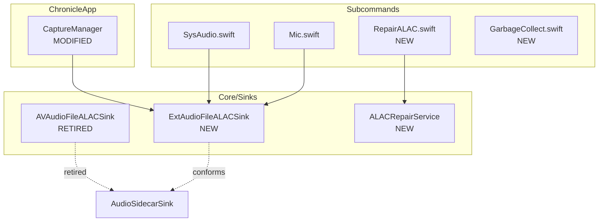
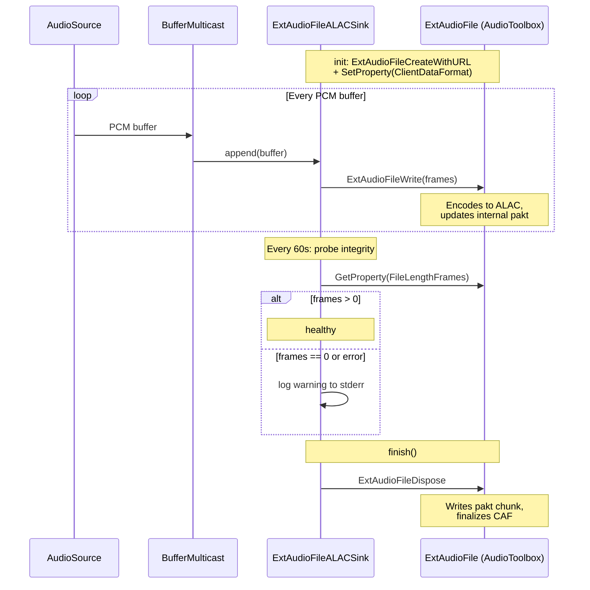
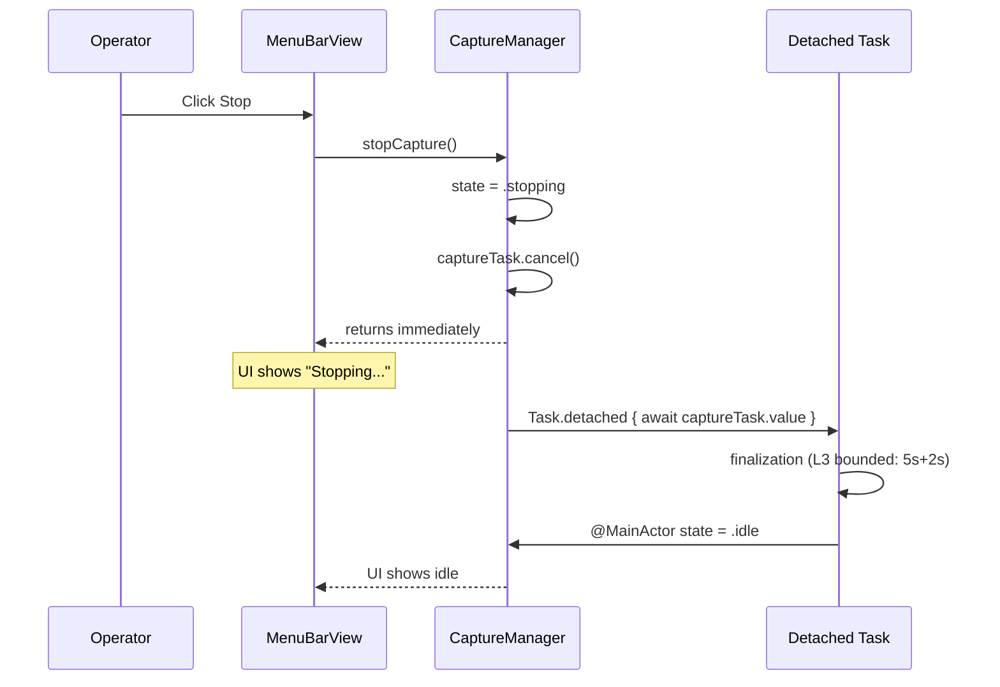
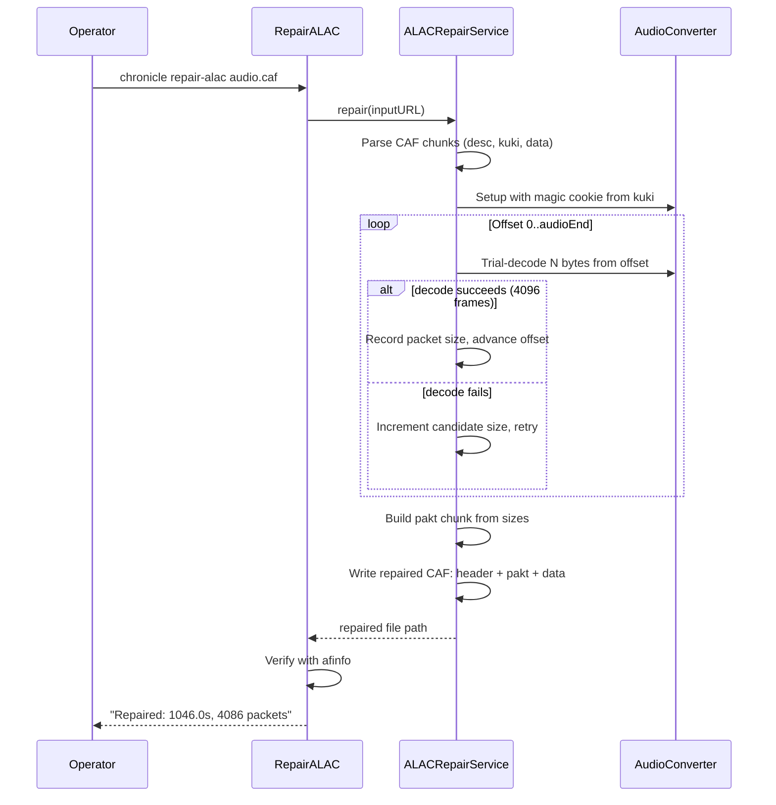

# Design Document

## Overview

**Purpose**: This feature fixes Chronicle's audio recording pipeline so that ALAC CAF sidecars are always decodable, provides recovery tooling for existing broken recordings, and addresses session hygiene and UI reliability issues that surfaced during real-world use.

**Users**: The Chronicle operator who runs live mic/sysaudio capture during meetings and work sessions, and expects both transcripts and audio to be usable after capture ends.

**Impact**: Replaces `AVAudioFileALACSink` (broken on Tahoe) with an `ExtAudioFile`-based sink, adds a `repair-alac` subcommand for existing broken CAFs, a `gc` subcommand for empty session cleanup, write-time audio integrity checks, and fixes the ChronicleApp Stop button to never block the main thread.

### Goals
- Every ALAC CAF produced after the fix is fully decodable by afinfo/ffmpeg/afconvert
- Existing broken CAF recordings are recoverable via `chronicle repair-alac`
- Empty/failed session directories are cleanable via `chronicle gc`
- Audio health problems are surfaced during recording, not hours later
- Stop button responds within 500 ms regardless of pipeline state

### Non-Goals
- Changing the default audio format (ADR-0002 ALAC-in-CAF stays)
- CoreAudio tap infrastructure changes (sysaudio-runtime-hardening owns that)
- Daemon control plane integration (agent-safe-capture-daemon-control-plane owns that)
- Transcript pipeline modifications
- App Store distribution

## Boundary Commitments

### This Spec Owns
- `ExtAudioFileALACSink` — replacement ALAC writer using AudioToolbox's `ExtAudioFile`
- `RepairALAC` subcommand — ALAC CAF recovery via AudioConverter trial-decode
- `GC` subcommand — empty session directory cleanup
- Write-time audio integrity probe inside the ALAC sink
- `CaptureManager.stopCapture()` non-blocking fix
- ADR-0002 amendment documenting the Tahoe `AVAudioFile.close()` bug

### Out of Boundary
- `AVAudioFileALACSink` internals (retired, not modified — replaced wholesale)
- Existing rotation combinator logic (`maybeRotating`) — consumed as-is
- Other audio sinks (WAV, Opus, scratch) — unchanged
- CoreAudio tap lifecycle — sysaudio-runtime-hardening owns this
- Daemon RPC layer — agent-safe-capture-daemon-control-plane owns this
- Transcript sinks — unchanged
- ChronicleApp UI layout beyond the Stop button fix

### Allowed Dependencies
- AudioToolbox (`ExtAudioFile`, `AudioConverter`) — C API, stable since macOS 10.4
- ChronicleCore / `AudioSidecarSink` protocol — upstream, consumed
- Existing `maybeRotating` rotation combinator — consumed
- Existing `CaptureManager` / `LiveCaptureSession` — modified for stop-button fix
- Swift Testing framework — for new tests

### Revalidation Triggers
- `AudioSidecarSink` protocol signature changes
- `CaptureManager` lifecycle method changes
- `maybeRotating` factory signature changes
- Default audio format decision changes (ADR-0002 future amendments)

## Architecture

### Existing Architecture Analysis

The current audio sidecar pipeline:
1. `Mic.swift` / `SysAudio.swift` / `CaptureManager.swift` build an `AudioSidecarSink` via `AVAudioFileALACSink(url:sourceFormat:)`.
2. The sink is wrapped in `maybeRotating(label:factory:)` for segment rotation.
3. PCM buffers from `BufferMulticast` fan out to the sink via `sink.append(buffer)`.
4. On stop, `sink.finish()` is called → `AVAudioFile.close()` → **pakt chunk NOT written** on Tahoe.

The `CaptureManager.stopCapture()` path:
1. `captureTask?.cancel()` — cooperative cancel signal
2. `await captureTask?.value` — **blocks the caller** until finalization completes
3. If the caller is on MainActor (SwiftUI button action), the UI freezes

### Architecture Pattern & Boundary Map



**Architecture Integration**:
- Selected pattern: **Drop-in protocol conformance replacement** — `ExtAudioFileALACSink` conforms to `AudioSidecarSink` with the same `init(url:sourceFormat:)` signature, making it a zero-change swap at every call site.
- Existing patterns preserved: sink composition, `maybeRotating` combinator, `BufferMulticast` fan-out.
- New components: `ExtAudioFileALACSink` (sink), `ALACRepairService` (recovery engine), `RepairALAC` + `GarbageCollect` (subcommands).

### Technology Stack

| Layer | Choice | Role | Notes |
|-------|--------|------|-------|
| ALAC writing | AudioToolbox `ExtAudioFile` | Encode PCM → ALAC, manage pakt | Handles pakt on `ExtAudioFileDispose` |
| ALAC recovery | AudioToolbox `AudioConverter` | Trial-decode to find packet boundaries | Uses `kAudioConverterDecompressionMagicCookie` from CAF `kuki` chunk |
| Integrity probe | `ExtAudioFileGetProperty` | Read `kExtAudioFileProperty_FileLengthFrames` on the open file | Zero-cost property read, no re-open |
| Stop button | Swift structured concurrency | `Task.detached` for finalization | Main actor only flips state |

## File Structure Plan

### Directory Structure
```
Sources/Chronicle/
├── Core/Sinks/
│   ├── ExtAudioFileALACSink.swift    # NEW: replacement ALAC writer
│   ├── AVAudioFileALACSink.swift     # RETIRED: kept for reference, unused
│   └── ALACRepairService.swift       # NEW: trial-decode recovery engine
├── Subcommands/
│   ├── RepairALAC.swift              # NEW: chronicle repair-alac CLI
│   ├── GarbageCollect.swift          # NEW: chronicle gc CLI
│   ├── Mic.swift                     # MODIFIED: swap sink constructor
│   ├── SysAudio.swift                # MODIFIED: swap sink constructor (if using ALAC)
│   └── EncodeALAC.swift              # MODIFIED: swap sink constructor
├── Chronicle.swift                   # MODIFIED: register RepairALAC + GC commands
ChronicleApp/
├── Core/
│   └── CaptureManager.swift          # MODIFIED: non-blocking stopCapture
docs/
├── adr/
│   └── ADR-0002-audio-storage-format.md  # MODIFIED: Tahoe bug amendment
├── STATUS.md                         # MODIFIED: update phase board
Tests/ChronicleTests/
├── Sinks/
│   ├── ExtAudioFileALACSinkTests.swift   # NEW
│   └── ALACRepairServiceTests.swift      # NEW
├── Subcommands/
│   └── GarbageCollectTests.swift         # NEW
```

### Modified Files
- `Sources/Chronicle/Subcommands/Mic.swift` — replace `AVAudioFileALACSink` with `ExtAudioFileALACSink` in the `maybeRotating` factory
- `Sources/Chronicle/Subcommands/SysAudio.swift` — same swap if sysaudio uses the ALAC sink path
- `Sources/Chronicle/Subcommands/EncodeALAC.swift` — swap sink in the offline re-encoder
- `Sources/Chronicle/Core/Sinks/ScratchExporter.swift` — swap sink in scratch-to-ALAC export
- `ChronicleApp/Core/CaptureManager.swift` — non-blocking `stopCapture()` + integrity warning in session info
- `Sources/Chronicle/Chronicle.swift` — add `RepairALAC` and `GarbageCollect` to command list

## System Flows

### ALAC Write Flow (ExtAudioFile)



### Non-Blocking Stop Flow



### Repair-ALAC Flow



## Requirements Traceability

| Req | Summary | Components | Interfaces | Flows |
|-----|---------|------------|------------|-------|
| 1 | Reliable ALAC CAF finalization | ExtAudioFileALACSink | AudioSidecarSink | ALAC Write |
| 2 | Broken CAF recovery | ALACRepairService, RepairALAC | CLI subcommand | Repair-ALAC |
| 3 | Session directory hygiene | GarbageCollect | CLI subcommand | — |
| 4 | Write-time integrity verification | ExtAudioFileALACSink (probe) | stderr + UI bridge | ALAC Write (probe) |
| 5 | Stop button reliability | CaptureManager | stopCapture() | Non-Blocking Stop |
| 6 | ADR-0002 amendment | ADR-0002 doc | — | — |
| 7 | Segment rotation compat | ExtAudioFileALACSink + maybeRotating | AudioSidecarSink | ALAC Write |

## Components and Interfaces

| Component | Layer | Intent | Reqs | Dependencies | Contracts |
|-----------|-------|--------|------|-------------|-----------|
| ExtAudioFileALACSink | Core/Sinks | ALAC-in-CAF writer with proper pakt | 1, 4, 5, 7 | AudioToolbox | Service |
| ALACRepairService | Core/Sinks | Trial-decode recovery for broken CAFs | 2 | AudioToolbox | Service |
| RepairALAC | Subcommands | CLI for repair-alac | 2 | ALACRepairService | — |
| GarbageCollect | Subcommands | CLI for session gc | 3 | FileManager | — |
| CaptureManager | ChronicleApp/Core | Non-blocking stop + integrity warning | 5, 4 | ExtAudioFileALACSink | State |

### Core/Sinks Layer

#### ExtAudioFileALACSink

| Field | Detail |
|-------|--------|
| Intent | Drop-in replacement for AVAudioFileALACSink using AudioToolbox ExtAudioFile |
| Requirements | 1.1, 1.2, 1.3, 1.4, 1.5, 4.1, 4.2, 4.4, 4.5, 7.1, 7.2 |

**Responsibilities & Constraints**
- Conforms to `AudioSidecarSink` with identical `init(url:sourceFormat:)` signature
- Creates ALAC-in-CAF via `ExtAudioFileCreateWithURL` with `kAudioFormatAppleLossless` and `kAppleLosslessFormatFlag_16BitSourceData`
- Sets client format to Int16 PCM matching `sourceFormat`
- Converts non-Int16 input via internal `AVAudioConverter` (same as current sink)
- On `finish()`: calls `ExtAudioFileDispose` which writes pakt + finalizes CAF
- Integrity probe: every 60s, reads `kExtAudioFileProperty_FileLengthFrames`; logs warning if 0

**Dependencies**
- Inbound: Mic/SysAudio/CaptureManager via `AudioSidecarSink` protocol (P0)
- Outbound: AudioToolbox `ExtAudioFile` C API (P0)

**Contracts**: Service [x]

##### Service Interface
```swift
public final class ExtAudioFileALACSink: AudioSidecarSink, @unchecked Sendable {
    public init(url: URL, sourceFormat: AVAudioFormat) throws
    public func append(_ buffer: AVAudioPCMBuffer) async
    public func appendOrThrow(_ buffer: AVAudioPCMBuffer) throws -> AVAudioFrameCount
    public func finish() async
}
```
- Preconditions: `sourceFormat` is mono or stereo PCM at any sample rate
- Postconditions: after `finish()`, the CAF at `url` has a valid pakt chunk and is decodable
- Invariants: no `append` calls after `finish()`

**Implementation Notes**
- `ExtAudioFileWrite` accepts `AudioBufferList`, not `AVAudioPCMBuffer`. Bridge via `buffer.audioBufferList.pointee`.
- The `ExtAudioFileRef` is not Sendable. The sink is `@unchecked Sendable` (same pattern as the current sink) with all access serialized.
- `finish()` must nil out the `ExtAudioFileRef` after dispose to prevent double-dispose.
- Error on `ExtAudioFileWrite`: log to stderr, preserve partial data. Do not crash the pipeline.

#### ALACRepairService

| Field | Detail |
|-------|--------|
| Intent | Recover broken ALAC CAFs by rebuilding the pakt chunk via trial-decode |
| Requirements | 2.1, 2.2, 2.3, 2.4, 2.5, 2.6 |

**Responsibilities & Constraints**
- Parses CAF chunk structure to locate `desc`, `kuki`, and `data` chunks
- Extracts magic cookie from `kuki` and sets up `AudioConverter` for ALAC → PCM decode
- Trial-decodes from each offset to find exact packet boundaries
- Builds a valid pakt chunk with real per-packet sizes
- Writes repaired CAF: original header chunks + new pakt (before data) + audio data (truncated to actual packet bytes)
- Validates result via `afinfo` (subprocess) before reporting success

**Dependencies**
- Outbound: AudioToolbox `AudioConverter` (P0)
- Outbound: Foundation `FileManager`, `Data`, `Process` (afinfo verification) (P0)

**Contracts**: Service [x]

##### Service Interface
```swift
public struct ALACRepairService {
    public struct RepairResult {
        public let outputURL: URL
        public let packetCount: Int
        public let totalFrames: Int64
        public let duration: TimeInterval
    }

    public enum RepairError: Error {
        case notALACCAF(String)
        case missingChunk(String)
        case noPacketsDecoded
        case verificationFailed(String)
    }

    public static func repair(
        inputURL: URL,
        outputURL: URL
    ) throws -> RepairResult
}
```
- Preconditions: `inputURL` is a CAF with ALAC desc and kuki but missing/invalid pakt
- Postconditions: `outputURL` is a decodable ALAC CAF; original file unchanged
- Invariants: never modifies inputURL unless `--in-place` rewrites via caller

### Subcommands Layer

#### RepairALAC

| Field | Detail |
|-------|--------|
| Intent | CLI veneer for `chronicle repair-alac` |
| Requirements | 2.1, 2.5, 2.6 |

**Implementation Notes**
- Arguments: one or more CAF file paths, `--output-dir` (default: same dir as input with `-repaired` suffix), `--in-place` flag
- For each input: call `ALACRepairService.repair`, report result or skip with diagnostic
- Registered in `Chronicle.swift` command list

#### GarbageCollect

| Field | Detail |
|-------|--------|
| Intent | CLI veneer for `chronicle gc` |
| Requirements | 3.1, 3.2, 3.3, 3.4, 3.5, 3.6 |

**Implementation Notes**
- Scans `~/Documents/chronicle/{mic,sysaudio}/` by default; accepts `--path` override
- A session directory is empty if it contains zero files matching `*.caf`, `*.wav`, `*.pcm`, `finals.md`, `trace.jsonl`, `live.log`, `live.md`, `format.json`
- Lists candidates with creation dates; requires `--yes` or interactive confirmation to delete
- `--dry-run` lists without deleting
- Tests use `/tmp` fixture directories, never real `~/Documents`

### ChronicleApp Layer

#### CaptureManager (Modified)

| Field | Detail |
|-------|--------|
| Intent | Non-blocking `stopCapture()` + audio integrity warning |
| Requirements | 5.1, 5.2, 5.3, 5.4, 5.5, 4.3 |

**State Change**:
```swift
// Current (blocks MainActor):
func stopCapture() async {
    captureTask?.cancel()
    await captureTask?.value   // ← blocks main thread
    state = .idle
}

// Fixed (non-blocking):
func stopCapture() async {
    guard case .recording = state else { return }
    state = .stopping          // ← immediate UI feedback
    captureTask?.cancel()
    let task = captureTask
    captureTask = nil
    Task.detached { [weak self] in
        await task?.value      // ← finalization off main thread
        await MainActor.run {
            self?.durationTask?.cancel()
            self?.durationTask = nil
            self?.state = .idle
        }
    }
}
```

**New state case**: `.stopping` added to `CaptureState` enum, shown as a spinner in `MenuBarView`.

**Audio integrity warning**: When `ExtAudioFileALACSink` logs an integrity warning, `CaptureManager` can expose it via an observable `audioHealthWarning: String?` property. The menubar's `SessionInfoView` shows it when non-nil.

## Error Handling

### Error Strategy
- **ExtAudioFile write failures**: log to stderr with session path; continue recording (best-effort partial data)
- **ExtAudioFile create failures**: throw from `init` → captured by caller (same as current sink)
- **Repair failures**: per-file skip with diagnostic message; non-zero exit only if ALL files fail
- **GC permission errors**: log and skip; never force-delete

### Monitoring
- `ExtAudioFileALACSink` integrity probe: stderr `[audio.integrity]` channel, at most once per 60s
- `CaptureManager.audioHealthWarning`: observable property for UI
- Repair subcommand: stdout summary (files repaired / skipped / failed)

## Testing Strategy

### Unit Tests
- `ExtAudioFileALACSinkTests`: write 4096-frame buffer → finish → verify CAF with afinfo (duration, packet count, decodability)
- `ExtAudioFileALACSinkTests`: write multiple buffers, verify total frame count matches
- `ExtAudioFileALACSinkTests`: rotation — finish + re-init, verify each segment individually decodable
- `ALACRepairServiceTests`: create a known-broken CAF (strip pakt from a valid one), repair, verify
- `GarbageCollectTests`: create /tmp fixture with empty + non-empty dirs, verify correct identification

### Integration Tests
- `Mic.swift` + `ExtAudioFileALACSink`: offline transcribe → verify CAF readable
- `CaptureManager` stop: verify state transitions `recording → stopping → idle` without MainActor blocking

### Smoke Tests
- Live mic capture (short burst) → verify `audio.caf` decodable after stop
- `chronicle repair-alac` on today's broken recordings → verify full decode
- `chronicle gc --dry-run` on real session dirs → verify empty dirs identified, non-empty preserved
