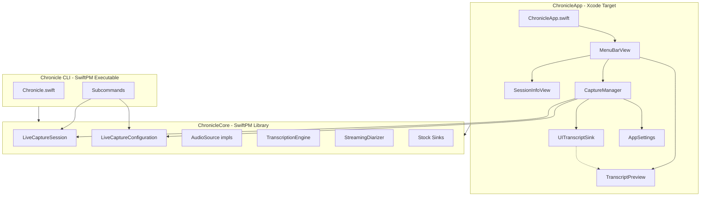
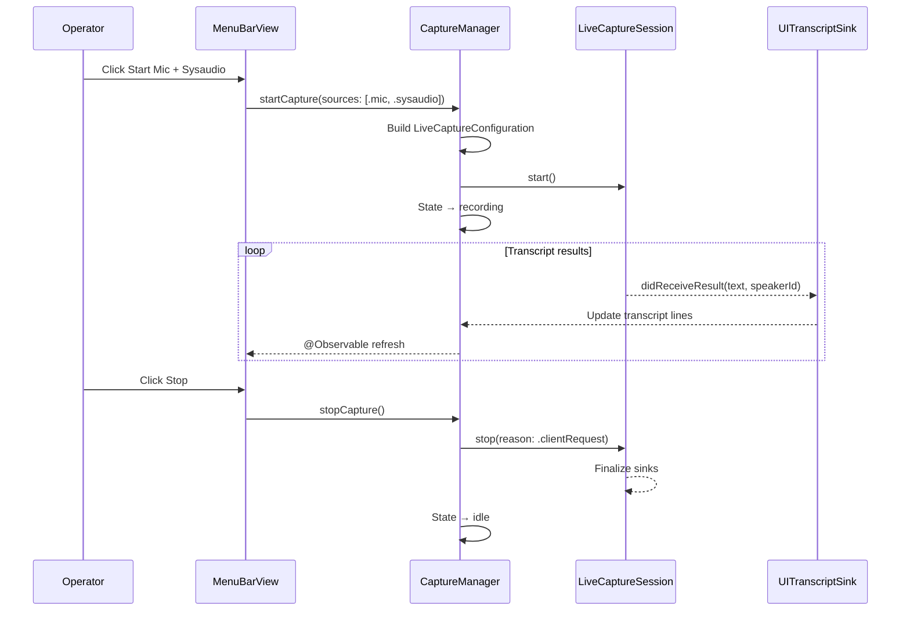
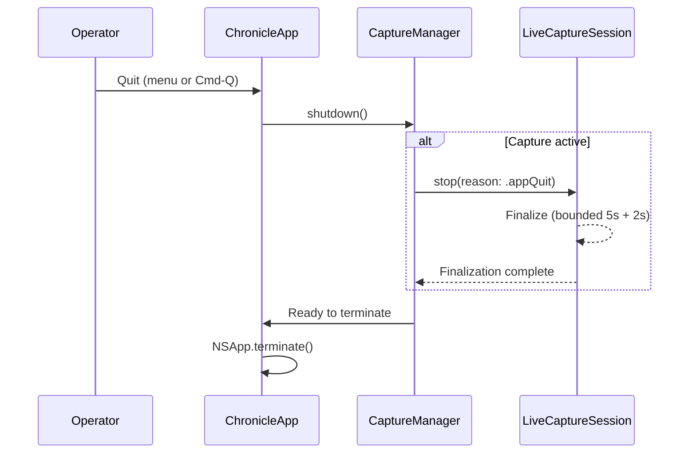

# Design Document

## Overview

**Purpose**: This feature delivers a macOS menu bar application for Chronicle, replacing the CLI as the primary operator interface for live audio capture, transcription, and diarization.

**Users**: The operator (single-user, local-only) uses this for persistent two-click access to mic and system audio capture during meetings and work sessions.

**Impact**: Introduces a new Xcode app target that consumes the existing `Core/` infrastructure as a SwiftPM library. Retires `make-app.sh` as the production app bundling path.

### Goals
- Persistent menu bar presence with capture status indication
- Two-click start/stop for mic, sysaudio, or both with diarization toggle
- Live transcript preview in the dropdown without file tailing
- Proper Xcode-managed signing replacing the `make-app.sh` shell script
- Designed as the future daemon host process for P12

### Non-Goals
- Daemon RPC server / Unix socket (deferred to P12 spec update)
- Floating transcript overlay window
- UI for offline subcommands (transcribe, diarize, merge stay CLI-only)
- App Store distribution or notarization
- Manual audio output device selection
- Locale or language selection UI

## Boundary Commitments

### This Spec Owns
- `ChronicleCore` SwiftPM library target extraction from `Core/`
- Xcode macOS app project (`ChronicleApp/`) with MenuBarExtra
- `CaptureManager` actor bridging `LiveCaptureSession` to SwiftUI observation
- `UITranscriptSink` for in-pipeline transcript delivery to the UI
- App signing, entitlements, Info.plist (Xcode-native)
- Login item registration via `SMAppService`
- `AppSettings` for persisted preferences (diarization default, launch-at-login)
- Documentation updates (README, AGENTS.md, STATUS.md)

### Out of Boundary
- `Core/` protocol behavior — consumed as-is, not modified
- Daemon RPC layer (`Core/Daemon/` wiring) — P12 adds this to the app process later
- Transcript file format or sink behavior — existing sinks unchanged
- Audio format decisions (ALAC/scratch/Opus) — ADR-0002/ADR-0005 unchanged
- CLI subcommand behavior — unchanged, builds independently via SwiftPM
- Locale auto-detect (ADR-0006) — not wired into the app

### Allowed Dependencies
- `ChronicleCore` library (upstream: this spec extracts it)
- SwiftUI, AppKit (`NSWorkspace` for Finder reveal), ServiceManagement (`SMAppService`)
- No external packages for the app target — only Apple frameworks
- The app target depends on `ChronicleCore` via local Swift package; the CLI target also depends on `ChronicleCore`

### Revalidation Triggers
- `LiveCaptureSession` API changes (start/stop/reconfigure/status signatures)
- `TranscriptionSink` protocol changes (didReceiveResult signature)
- `LiveCaptureConfiguration` structural changes (new required fields)
- Bundle identifier or signing identity changes
- P12 daemon integration modifying the app's process lifecycle

## Architecture

### Existing Architecture Analysis

Chronicle is a SwiftPM executable with modular `Core/` protocols:
- `AudioSource` → `MicAudioSource`, `CoreAudioTapSource`
- `TranscriptionSink` → `JSONLTraceSink`, `LiveFileSink`, `FinalsAppendSink`, audio sidecars
- `LiveCaptureSession` actor → start/stop/reconfigure/status lifecycle
- `StreamingDiarizing` → `SortformerStreamingDiarizer`

The subcommands (Mic, SysAudio, Live) are thin veneers that build a `LiveCaptureConfiguration`, create a `LiveCaptureSession`, and iterate results through sinks. The menu bar app follows the same pattern — it is another client of `LiveCaptureSession`.

`Core/` has zero imports from `Subcommands/` or `Chronicle.swift`, making library extraction clean.

### Architecture Pattern and Boundary Map



**Architecture Integration**:
- Selected pattern: **Direct library consumption** — app embeds `ChronicleCore` in-process, no IPC
- Domain boundaries: `ChronicleCore` owns capture/transcription; `ChronicleApp` owns UI and app lifecycle
- Existing patterns preserved: sink composition, actor-based session lifecycle, protocol-oriented audio sources
- New components: `CaptureManager` (app-side orchestrator), `UITranscriptSink` (pipeline → UI bridge), `AppSettings` (preference persistence)
- Dependency direction: Types → ChronicleCore → CaptureManager → Views → App

### Technology Stack

| Layer | Choice | Role | Notes |
|-------|--------|------|-------|
| UI | SwiftUI MenuBarExtra (menu style) | Menu bar dropdown | macOS 13+; native NSMenu integration |
| State | @Observable macro (Observation framework) | Reactive UI state | Swift 5.9+ / macOS 14+ |
| Capture | ChronicleCore (LiveCaptureSession) | Audio capture + transcription + diarization | Existing Core/ extracted as library |
| Persistence | UserDefaults | Diarization default, launch-at-login | Standard macOS preference storage |
| Login Item | SMAppService.mainApp | Launch at login registration | macOS 13+ ServiceManagement |
| Signing | Xcode automatic signing | Apple Development, team CXLYTY8DMR | Replaces make-app.sh |

## File Structure Plan

### Directory Structure

```
Package.swift                        # MODIFIED: add ChronicleCore library product + target
Sources/Chronicle/
├── Chronicle.swift                  # MODIFIED: CLI target now depends on ChronicleCore
├── Core/                            # UNCHANGED: source files stay in place
└── Subcommands/                     # UNCHANGED: CLI-only veneers
ChronicleApp/                        # NEW: Xcode app project directory
├── ChronicleApp.xcodeproj/          # Xcode project with local package dependency
├── ChronicleApp.swift               # @main App, MenuBarExtra, single-instance check
├── Info.plist                        # TCC strings, bundle ID, app category
├── ChronicleApp.entitlements         # audio-input, app-sandbox exceptions
├── Assets.xcassets/                  # Menu bar icon (idle/recording/error states)
├── Core/
│   ├── CaptureManager.swift          # @Observable actor wrapping LiveCaptureSession
│   ├── CaptureState.swift            # Enum: idle, recording(sources), error(message)
│   ├── TranscriptLine.swift          # Value type: text, speakerId, timestamp, isFinal
│   └── AppSettings.swift             # UserDefaults wrapper: diarization, launchAtLogin
├── Sinks/
│   └── UITranscriptSink.swift        # TranscriptionSink → bounded line buffer for UI
└── Views/
    ├── MenuBarView.swift              # Dropdown: controls, toggles, session info, actions
    ├── TranscriptPreview.swift        # Last N transcript lines with speaker labels
    └── SessionInfoView.swift          # Duration, active sources, speaker count
Tests/ChronicleTests/                 # MODIFIED: update imports for Core/ types
```

### Modified Files

- **`Package.swift`** — Add `.library(name: "ChronicleCore", targets: ["ChronicleCore"])` product. Add `ChronicleCore` target pointing at `Sources/Chronicle/Core`. Update `Chronicle` executable target to depend on `ChronicleCore`. Remove `Core/` from the executable target's source paths.
- **`Tests/ChronicleTests/`** — Update `@testable import Chronicle` to `@testable import ChronicleCore` for tests targeting `Core/` types. Tests targeting `Subcommands/` keep importing `Chronicle`.

## System Flows

### Capture Start Flow



### Clean Shutdown Flow



## Requirements Traceability

| Req | Summary | Components | Interfaces | Flows |
|-----|---------|------------|------------|-------|
| 1 | Menu bar presence | ChronicleApp, MenuBarView, CaptureState | MenuBarExtra scene | — |
| 2 | Capture source controls | CaptureManager, MenuBarView | startCapture/stopCapture | Capture Start |
| 3 | Diarization control | CaptureManager, AppSettings, MenuBarView | toggleDiarization | — |
| 4 | Live transcript preview | UITranscriptSink, TranscriptPreview, CaptureManager | TranscriptionSink protocol | Capture Start (loop) |
| 5 | Session information | CaptureManager, SessionInfoView | status() | — |
| 6 | Session file access | MenuBarView | NSWorkspace.shared.selectFile | — |
| 7 | Launch at login | AppSettings, MenuBarView | SMAppService.mainApp | — |
| 8 | Clean shutdown | CaptureManager, ChronicleApp | shutdown() | Clean Shutdown |
| 9 | Single instance | ChronicleApp | NSRunningApplication check | — |
| 10 | CLI continuity | Package.swift (library extraction) | — | — |
| 11 | App build and signing | ChronicleApp.xcodeproj, entitlements, Info.plist | — | — |

## Components and Interfaces

| Component | Layer | Intent | Reqs | Dependencies | Contracts |
|-----------|-------|--------|------|-------------|-----------|
| ChronicleApp | App | @main entry, MenuBarExtra scene, single-instance | 1, 9 | CaptureManager (P0) | State |
| CaptureManager | Core | Wraps LiveCaptureSession, exposes @Observable state | 2, 3, 4, 5, 8 | LiveCaptureSession (P0), AppSettings (P1), UITranscriptSink (P0) | Service, State |
| UITranscriptSink | Sinks | TranscriptionSink → bounded line buffer | 4 | TranscriptionSink protocol (P0) | Service |
| AppSettings | Core | UserDefaults persistence for preferences | 3, 7 | UserDefaults (P0), SMAppService (P1) | State |
| MenuBarView | Views | Dropdown content: controls, toggles, actions | 1, 2, 3, 6, 7 | CaptureManager (P0), AppSettings (P0) | — |
| TranscriptPreview | Views | Renders last N transcript lines | 4 | CaptureManager (P0) | — |
| SessionInfoView | Views | Duration, sources, speaker count | 5 | CaptureManager (P0) | — |

### Core Layer

#### CaptureManager

| Field | Detail |
|-------|--------|
| Intent | Bridges LiveCaptureSession lifecycle to SwiftUI @Observable state |
| Requirements | 2, 3, 4, 5, 8 |

**Responsibilities and Constraints**
- Owns the `LiveCaptureSession` instance and its lifecycle (create → start → stop → finalize)
- Builds `LiveCaptureConfiguration` from current `AppSettings` and requested sources
- Injects `UITranscriptSink` into the sink pipeline alongside stock sinks
- Exposes `CaptureState`, transcript lines, session duration, and speaker count as observable properties
- Handles bounded shutdown: delegates to LiveCaptureSession's finalization with existing L3 timeout defense

**Dependencies**
- Inbound: MenuBarView — user actions (P0)
- Outbound: LiveCaptureSession — capture lifecycle (P0)
- Outbound: UITranscriptSink — transcript line buffer (P0)
- Outbound: AppSettings — read preferences for configuration (P1)

**Contracts**: Service [x] / State [x]

##### Service Interface
```swift
@Observable
final class CaptureManager {
    var state: CaptureState { get }
    var transcriptLines: [TranscriptLine] { get }
    var sessionDuration: Duration? { get }
    var speakerCount: Int { get }
    var activeSources: Set<CaptureSource> { get }
    var sessionOutputURL: URL? { get }

    func startCapture(sources: Set<CaptureSource>) async throws
    func stopCapture() async
    func toggleDiarization() async
    func shutdown() async
}

enum CaptureSource: String, CaseIterable {
    case mic
    case sysaudio
}

enum CaptureState: Equatable {
    case idle
    case recording(sources: Set<CaptureSource>)
    case error(message: String)
}
```

- Preconditions: `startCapture` requires state == `.idle`; `stopCapture` requires state == `.recording`
- Postconditions: `startCapture` transitions to `.recording`; `stopCapture` transitions to `.idle`; `shutdown` finalizes and transitions to `.idle`
- Invariants: Only one capture session exists at a time

#### UITranscriptSink

| Field | Detail |
|-------|--------|
| Intent | TranscriptionSink that buffers last N final lines for UI consumption |
| Requirements | 4 |

**Responsibilities and Constraints**
- Conforms to `TranscriptionSink`
- Buffers last N final transcript results (configurable, default ~50 lines)
- Each line includes text, optional speaker ID, and timestamp
- Thread-safe: sink methods called from capture background; UI reads from main actor

**Contracts**: Service [x]

##### Service Interface
```swift
final class UITranscriptSink: TranscriptionSink {
    var lines: [TranscriptLine] { get }
    var speakerCount: Int { get }

    func didReceiveResult(text: String, isFinal: Bool,
                          wallclockOffsetMs: Int?, wallclock: Date?,
                          audioRange: Range<TimeInterval>?,
                          speakerId: String?) async
    func finish() async
}

struct TranscriptLine: Identifiable, Equatable {
    let id: UUID
    let text: String
    let speakerId: String?
    let timestamp: Date
}
```

#### AppSettings

| Field | Detail |
|-------|--------|
| Intent | Persists operator preferences in UserDefaults |
| Requirements | 3, 7 |

**Contracts**: State [x]

##### State Management
```swift
@Observable
final class AppSettings {
    var diarizationEnabled: Bool  // persisted to UserDefaults
    var launchAtLogin: Bool       // persisted + toggles SMAppService.mainApp

    init()  // reads from UserDefaults, syncs SMAppService state
}
```

- Persistence: `UserDefaults.standard` with keys prefixed `chronicle.`
- `launchAtLogin` setter calls `SMAppService.mainApp.register()` / `.unregister()`

### App Layer

#### ChronicleApp

| Field | Detail |
|-------|--------|
| Intent | SwiftUI @main entry point with MenuBarExtra scene |
| Requirements | 1, 9 |

**Implementation Notes**
- Single-instance: check `NSRunningApplication.runningApplications(withBundleIdentifier:)` in `init()`; if already running, activate existing and call `NSApp.terminate(nil)`
- MenuBarExtra with `isInserted: .constant(true)` — always visible when app runs
- Status icon: SF Symbol or custom asset set, varies by `CaptureState` (idle/recording/error)
- App termination handler calls `CaptureManager.shutdown()` before exit

### Views Layer

Presentational components — no new boundaries. Summary only.

- **MenuBarView**: Reads `CaptureManager.state` and `AppSettings`. Renders start/stop buttons per source, diarization toggle, session info, open-folder button, launch-at-login toggle, quit button.
- **TranscriptPreview**: Reads `CaptureManager.transcriptLines`. Renders last N lines with optional `[S0]` speaker prefix. Shows "No active session" when idle.
- **SessionInfoView**: Reads `CaptureManager.sessionDuration`, `activeSources`, `speakerCount`. Formats elapsed time, lists active sources, shows speaker count when diarization active.

## Error Handling

### Error Strategy
- **TCC denial**: `CoreAudioTapSource` and `MicAudioSource` throw on permission failure → `CaptureManager` catches, transitions to `.error(message:)` state with remediation text
- **Audio source failure**: Thrown from `LiveCaptureSession.start()` → same `.error` path
- **Finalization timeout**: Existing L3 defense (5s + 2s bounded finalize) → `CaptureManager.stopCapture` / `shutdown` always returns

### Monitoring
- Status icon color change is the primary error indicator (Req 1.5)
- Error message displayed in dropdown when in `.error` state
- Underlying capture diagnostics continue to go to stderr / `--verbose` logs (not surfaced in menu bar)

## Testing Strategy

### Unit Tests
- `CaptureManager` state transitions: idle → recording → idle, idle → recording → error, shutdown while recording
- `UITranscriptSink` line buffering: capacity bounds, speaker count, finish() clears
- `AppSettings` persistence: round-trip UserDefaults read/write, SMAppService toggle
- `CaptureState` equality and description

### Integration Tests
- `CaptureManager` with mock `LiveCaptureSession`: verify start/stop calls, transcript line flow, reconfigure for diarization toggle
- `UITranscriptSink` integration with `CaptureManager`: verify lines propagate to observable state

### Manual Verification
- Build from Xcode → verify codesign, TCC grant, menu bar icon appears
- Start mic capture → verify transcript lines in dropdown
- Start sysaudio capture with TTS playback → verify transcript
- Toggle diarization → verify speaker labels appear/disappear
- Open session folder → Finder reveals correct directory
- Quit while recording → verify finals.md and trace.jsonl are complete
- Launch at login → reboot → verify app appears in menu bar
- CLI `swift build && swift test` → verify all 108+ tests still pass
