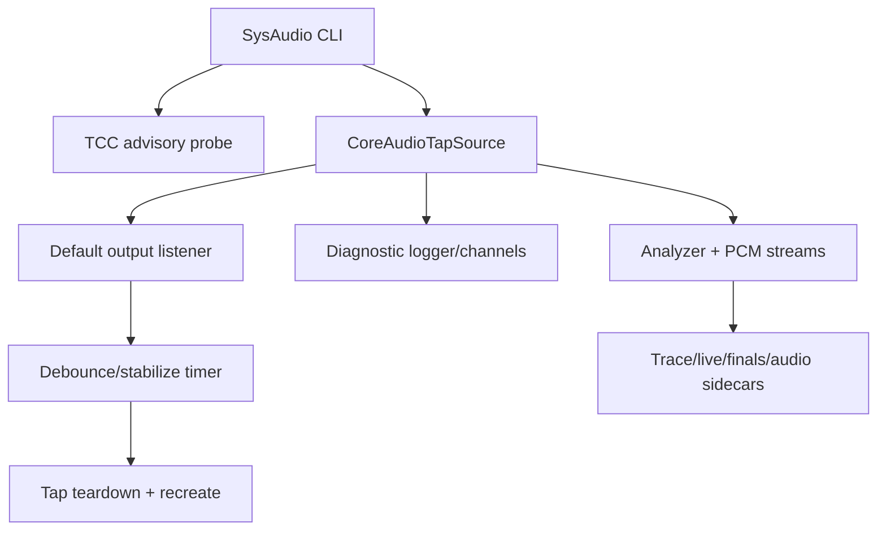

# Design Document

## Overview

This feature hardens the already verified CoreAudio tap `sysaudio` path. It does not change the transcription pipeline; it changes how Chronicle interprets preflight status, follows output-device switches, and emits diagnostics.

The critical contract is: **runtime PCM/transcript evidence is authoritative**. TCC preflight via private SPI is useful context only, because it can report denial while `/Applications/chronicle.app` still captures and transcribes real system audio.

### Goals

- Remove false-failure wording from TCC preflight messages.
- Rebuild the tap once per stable output-device switch, not once per transient notification.
- Split sysaudio logs into clear channels/verbosity levels.
- Update specs/docs to reflect the verified local signed-app path.

### Non-Goals

- No ScreenCaptureKit migration.
- No BlackHole/Multi-Output default routing.
- No combined mic+sysaudio daemon.
- No launchd/login item.

## Boundary Commitments

### This Spec Owns

- Sysaudio startup warning semantics.
- CoreAudio default-output listener debounce.
- Sysaudio/tap logging channel and verbosity shape.
- Documentation updates for verified sysaudio behavior.

### Out of Boundary

- SpeechAnalyzer behavior and transcript result semantics.
- Audio sidecar container/rotation strategy.
- Locale, diarization, merge, tagging, and scratch recovery feature design.
- External system audio loopback fallback recorders.

### Allowed Dependencies

- Existing `CoreAudioTapSource` tap lifecycle and source protocol.
- Existing `TCCPreflight` / `TCCSystemAudio` private SPI wrapper.
- Existing `TranscriptionLatencyMonitor` behavior, with output rate-limiting if necessary.
- Existing Swift Testing suite and signed app build script.

### Revalidation Triggers

- Any change to TCC authority or preflight semantics.
- Any change to tap lifecycle teardown/recreate order.
- Any change to output-device listener behavior.
- Any change to CLI flags controlling logging.

## Architecture

### Existing Architecture Analysis

`SysAudio.swift` composes:

```text
CoreAudioTapSource
  → AnalyzerInput stream → SpeechAnalyzer
  → PCMBufferRef stream → audio sidecars / diarizer / locale probe
  → TranscriptionSink fan-out → live.md, finals.md, trace.jsonl
```

`CoreAudioTapSource` currently installs a `kAudioHardwarePropertyDefaultOutputDevice` listener. The listener immediately reads the new default output and rebuilds the tap. Live testing showed this works but flaps through transient devices and Chronicle's own aggregate churn.

`TCCPreflight.systemAudioRecording()` uses private SPI. Live testing showed it can report `.denied` while the signed app still captures nonzero PCM and produces transcript text.

### Architecture Pattern & Boundary Map



### Technology Stack

| Layer | Choice / Version | Role in Feature | Notes |
|---|---|---|---|
| CLI | Swift ArgumentParser | Sysaudio flags and operator messages | Keep `--verbose`; add debug only if needed |
| Capture | CoreAudio process tap | Runtime system-audio source | Preserve teardown order |
| Logging | lightweight stderr logger/helper | Channel/verbosity separation | Avoid broad logging framework |
| Tests | Swift Testing | Unit coverage for debounce/log policy where feasible | Live smoke remains manual/process proof |

## File Structure Plan

### Modified Files

- `Sources/Chronicle/Subcommands/SysAudio.swift` — adjust TCC preflight wording and wire log verbosity/channel options if needed.
- `Sources/Chronicle/Core/Audio/TCCPreflight.swift` — update remediation to signed app target and advisory language.
- `Sources/Chronicle/Core/Audio/CoreAudioTapSource.swift` — add output-change debounce/stabilization and replace spammy verbose peak logging with channel-aware summaries/debug detail.
- `Sources/Chronicle/Core/Speech/TranscriptionLatencyMonitor.swift` — rate-limit repeated latency warnings if current behavior floods stderr.
- `Tests/ChronicleTests/Audio/CoreAudioTapSourceTests.swift` — add pure coverage for debounce helper behavior if factored out.
- `Tests/ChronicleTests/Audio/TCCPreflightTests.swift` — update expected remediation/advisory text.
- `README.md`, `AGENTS.md`, `docs/STATUS.md`, and `docs/adr/ADR-0007-tahoe-catap-zero-buffer-regression.md` — document verified state and cleanup contract.

## Components and Interfaces

### SysAudio Preflight Messaging

| Field | Detail |
|---|---|
| Intent | Surface TCC context without treating private preflight as capture authority |
| Requirements | 1.1, 1.2, 1.3, 1.4 |

**Responsibilities & Constraints**

- Preflight result is advisory.
- Runtime zero/nonzero evidence drives failure messaging.
- Remediation points at `/Applications/chronicle.app` for local signed app use.

### Default Output Debouncer

| Field | Detail |
|---|---|
| Intent | Coalesce transient CoreAudio output changes before rebuilding the tap |
| Requirements | 2.1, 2.2, 2.3, 2.4, 2.5 |

**Responsibilities & Constraints**

- Listener callback schedules debounce work on `listenerQueue`.
- A generation counter cancels older scheduled rebuilds.
- Stable output is re-read after ~500–750 ms.
- Rebuild only if stable output differs from `currentDefaultOutputID`.
- Keep existing teardown order: stop IOProc → destroy IOProc → drain queue → destroy aggregate → destroy tap → recreate all.

### Sysaudio Diagnostic Logger

| Field | Detail |
|---|---|
| Intent | Keep normal runs quiet and debugging runs informative |
| Requirements | 3.1, 3.2, 3.3, 3.4, 3.5 |

**Responsibilities & Constraints**

- Default: lifecycle/output/warning/error only.
- Verbose: state transitions and periodic summaries.
- Debug: per-buffer/per-64-buffer peak detail if retained.
- Prefix messages by channel such as `[sysaudio]`, `[sysaudio.tap]`, `[sysaudio.tap.debug]`, `[sysaudio.latency]`.

## Risks

- Debounce delay could miss a very short-lived output switch. Mitigation: use modest delay and re-read current default after delay.
- Logging changes could hide useful capture diagnostics. Mitigation: preserve debug-level peak detail and first-nonzero summary.
- TCC wording could under-warn real denial. Mitigation: keep runtime zero-buffer warnings and remediation, but make authority clear.

## Verification Plan

1. `swift test`.
2. `CHRONICLE_TEAM_ID=CXLYTY8DMR scripts/make-app.sh --install`.
3. Live sysaudio smoke with `say`:
   - nonzero max `sessionPeak`,
   - text in `finals.md`/`live.md`,
   - no misleading hard TCC failure wording.
4. Output-switch smoke if practical:
   - one stable rebuild message per switch,
   - capture continues after switch.
5. `git status` clean after commit/push.
